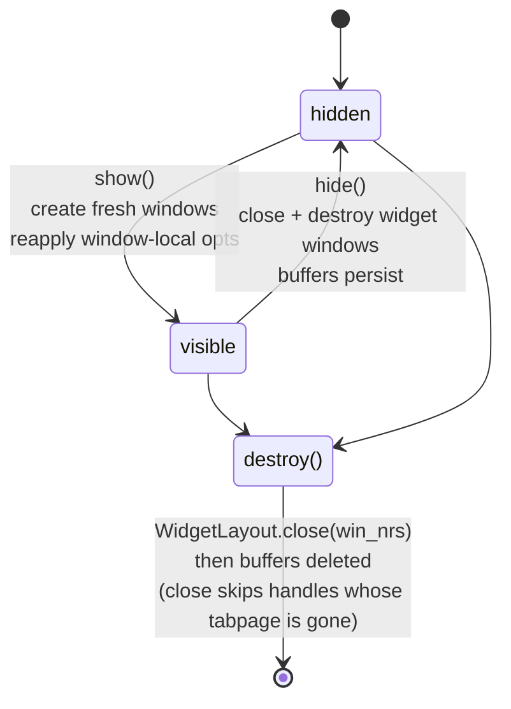

# ChatWidget lifecycle

Widget windows are disposable. Buffers persist; windows do not.

## State machine

Each transition cites the test that pins it. A transition without a test is a
gap: add the test or delete the transition.

Pinned by, in `lua/agentic/ui/chat_widget.test.lua`:

- `hidden -> visible`: `::"show() after hide() creates new windows"`,
  `::"show() is idempotent when called multiple times"`
- `visible -> hidden`: `::"hide() closes all windows and preserves buffers"`,
  `::"hide() is safe when called multiple times"`
- `hidden -> destroy`: `::"deletes the buffers of a hidden widget without raising"`
- `visible -> destroy`:
  `::"keeps the tabpage alive when the widget holds its only windows"`
- hidden float on `destroy`: `::"tears down the hidden chat window on destroy"`

## Rules

- `show` after `hide` creates fresh windows and applies every window-local
  option. `show` on a visible widget reuses its live windows; it reopens
  nothing.
- Before closing widget windows, `hide` ensures a non-widget fallback window
  exists in the same tabpage; if `find_first_non_widget_window` returns nil it
  calls `open_editor_window`. Skipping this destroys the user's tabpage: closing
  the last window of a non-current tabpage closes that tabpage silently, and E444
  (cannot close last window) only fires when it is also the last tabpage. See
  `ChatWidget:hide`.
- A caller that reaches `hide` across an async boundary MUST pass the tabpage it
  captured BEFORE the defer, as `hide(keep_insert, tabpage)`. `WinClosed` fires on
  `win_nrs.chat` and invalidates it before the scheduled `hide` runs, and
  `get_visible_tab_id` reads no other handle, so the derived placement is already
  nil there: `_ensure_fallback_window` returns early and the close takes the
  widget-only tabpage down with it. Only the tabpage IDENTITY crosses the boundary
  — `_ensure_fallback_window` and `find_first_non_widget_window` still re-check
  `nvim_tabpage_is_valid` on it. Regression:
  `chat_widget.test.lua::"keeps a widget-only tab alive when the chat window closes"`.
- `ChatWidget:open_editor_window` anchors on the first USABLE window in
  `win_nrs`, preferring chat. The chat handle is already dead on the `WinClosed`
  path above, and returning nil there is what loses the tabpage.
- Programmatic window closes (`hide`, layout rotation) MUST wrap the close call
  in `ChatWidget:_avoid_auto_close_cmd`. The wrapper sets `self._closing = true`
  so the `WinClosed` autocmd's auto-close-on-user-close branch skips the call.
  Skipping the wrapper triggers a recursive close through the autocmd. Tests:
  `chat_widget.test.lua` group `"WinClosed autocmd"`.
- `destroy` never routes through `hide`, but both share
  `ChatWidget:_ensure_fallback_window`. It calls that, then `WidgetLayout.close`
  on its `win_nrs`, then deletes the buffers. Relative to `hide` it skips
  hidden-float recreation, size capture, and `stopinsert` suppression — a
  destroyed widget is never shown again. `WidgetLayout.close` skips every handle
  whose tabpage is already gone, keeping this safe during a tabclose teardown on
  0.11.x. See `ChatWidget:destroy`.
  - The fallback is mandatory here. `SessionRegistry.show_session` hides
    non-target widgets in the current tabpage and hides the target at its previous
    placement, so an outgoing session in another tabpage stays visible. Destroying
    it reaches `WidgetLayout.close` there, and without the fallback that tabpage
    disappears under the user. Reachable from `Agentic.destroy_session` and from
    restore's explicit `Destroy current session` choice. Regression:
    `chat_widget.test.lua::"keeps the tabpage alive when the widget holds its only windows"`.
  - **Ordering: the fallback MUST run before `WidgetRegistry.unregister`.**
    `find_first_non_widget_window` excludes windows showing a registered widget
    buffer, so once unregistered the widget's own chat window looks like a valid
    fallback and gets handed back.
- `destroy` is the one programmatic close exempt from the
  `_avoid_auto_close_cmd` rule above. It deletes the
  `AgenticWinClosed_<chat bufnr>` augroup before closing, so the only listener
  that ever read `self._closing` is gone by then; setting the flag would guard
  nothing. Any new close path that runs while that augroup still exists MUST
  wrap.

## Widget buffers and windows

- Widget buffers are `buflisted = false` and `buftype = nofile`. Each widget
  window records its buffer in `vim.w[winid].agentic_bufnr`, 1:1. Users cannot
  swap buffers between widget windows; `BufferGuard` restores them.
- The `WinClosed` autocmd hides the WHOLE widget when the user closes any one
  widget window. The widget is one unit.

## Background sessions

A **background session** must never be surfaced by a content callback. The
`FileList`, `CodeSelection`, `DiagnosticsList` and `TodoList` `on_change`
handlers call `ChatWidget:rerender`, which no-ops when `get_visible_tab_id()` is
nil. Calling `show` directly there put a second widget in the current tabpage —
a `plan` update from a hidden session was enough, with no user action at all.
The update survives: panel buffers are written before `on_change` fires, and
`show_layout` decides each panel window from buffer emptiness at show time.
Regression:
`tests/integration/test_multi_session.lua::"keeps a hidden session hidden when its file list changes"`.

- **An EMPTY panel is the same path and MUST obey the same two rules.** The
  existing regression covers a non-empty panel only, and the empty case takes a
  different branch: `open_or_resize_dynamic_window` closes the panel window
  instead of opening one. That close runs asynchronously, so the cached handle
  can belong to a tabpage the user has since closed — stale-valid on 0.11.x,
  hence `BufHelpers.is_win_usable`, not bare validity — and closing it MUST NOT
  move the cursor out of the tab the user is looking at. Regression:
  `lua/agentic/ui/widget_layout.test.lua::"clears an empty panel whose tabpage is gone"`.
- A cached panel handle from ANOTHER tabpage MUST NOT be reused, and MUST be
  closed when the panel is reopened. Chat and input enforced this; dynamic
  panels did not, so a widget that moved tabpages left its panels behind and
  split one widget's topology across two tabs, the abandoned window untracked
  once `win_nrs` was repointed. Regression:
  `lua/agentic/ui/widget_layout.test.lua::"creates a fresh chat window when the cached one is in another tab"`.

## Hidden chat float

A hidden chat floating window keeps the chat buffer attached while the widget
is hidden, so manual folds can be applied while closed. See ADR 0001. Tests:
`chat_widget.test.lua` group `"hidden chat window lifecycle"`.

- Opened with `hide = true` + `focusable = false` + `noautocmd = true`. The user
  cannot reach it: `<C-w>w`/`<C-w>p`, `:wincmd`, and `:buffer` skip it;
  `nvim_list_wins()` returns it but interactive navigation does not visit it.
  Only code holding `widget._hidden_chat_winid` can target it (via
  `nvim_set_current_win`/`nvim_win_set_buf`). Treat it as an internal handle,
  not a window the user might be sitting in. Do NOT add keymaps, buffer-local
  autocmds expecting user focus, or any UX that assumes the user can act inside
  it.
- Reopening the hidden chat float without closing the previous one overwrites
  the stored winid and leaks the prior window. Regression:
  `chat_widget.test.lua::"does not leak a hidden float across hide() calls"`.
