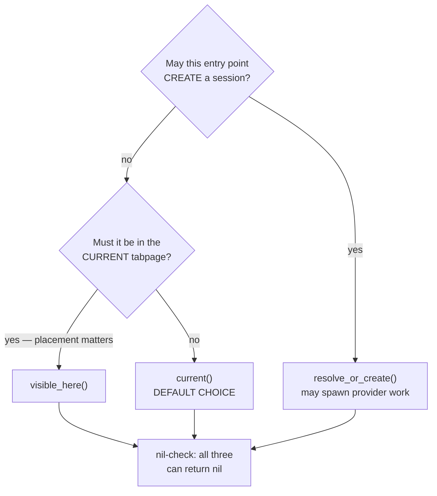

# Agents Guide

**agentic.nvim** is a Neovim plugin that emulates Cursor AI IDE behavior,
providing AI-driven code assistance through a chat interface.

## Nested instructions

Read these before touching the matching area:

- `lua/agentic/acp/AGENTS.md` - ACP client, tool calls, permissions, providers
- `lua/agentic/ui/AGENTS.md` - chat UI: topology, lifecycle contracts
  (open/close/destroy), MessageWriter state machines, tool-call block layout,
  folding, auto-scroll, permission reanchor, traps
- `tests/AGENTS.md` - test framework, TDD workflow, assertions, helpers

## Skill driven

This project splits instructions and repetitive workflows into skills.

**MANDATORY**: Load the related skill before suggesting a solution, writing to
lua files, or adding, updating, or creating unit tests.

Skills hold good practices, code standards, and architecture flows that may not
match your training data.
Load them before assuming your solution is right.

## Domain glossary — lazy read

`CONTEXT.md` (repo root) defines overloaded terms (Session, Agent, Provider,
Tool Call, Diff, etc.). Do NOT pre-read. Grep it for the ambiguous keyword
first; only Read the file if the grep matches. If no match, the term is not in
the glossary — proceed without loading.

## Architectural decisions (ADRs) — optional read

`docs/adr/` stores Architecture Decision Records. One file per subject,
`NNNN-short-slug.md` (4-digit). "ADR 2" = `0002-*.md`. Full template in
`docs/adr/README.md`.

Do NOT pre-read. Load only when:

- A rule in `AGENTS.md` is unclear, contested, or looks arbitrary.
- You are about to rewrite a subsystem an ADR covers.
- A reviewer asks "why didn't we do X?".

Discovery: grep `docs/adr/` for the keyword, read only on match. No match = no
ADR exists.

`ADR NNNN` cited in a nested `AGENTS.md`/`CONTEXT.md` is an implicit match, NOT
an auto-load. Read it only when a trigger above fires. Citation in passing is
not a trigger.

### grill-with-docs override

`grill-with-docs` skill ships a minimal ADR template. Path + 4-digit numbering
match this repo; the template does NOT. Use `docs/adr/README.md` verbatim. Keep
the `Rejected / superseded alternatives` table and `Changelog`. Changelog rows
contain only the date and change summary.

`CONTEXT.md`: glossary only, no implementation. Populate incrementally as
overloaded terms surface. Not a spec, scratchpad, or design doc.

## Anti-staleness rules for AGENTS.md files

- Cite **module + symbol**, never line numbers.
- Don't paste real implementation. Code blocks are for teaching examples (right
  vs. wrong patterns), signatures, and diagrams. Implementation drifts; teaching
  examples don't.
- Every "why" must reference an observable failure (flicker, crash, lost fold).
  If the failure is gone, delete the rule.
- New "FORBIDDEN" / "MUST" rule about runtime behavior = new test that fails
  without the rule. Reference the test by name in the rule body. Pure-style
  rules (formatting, naming, docs) are exempt.
- Fenced code blocks MUST have a language hint. Use `text` for free-form ASCII
  (trees, byte layouts, pseudocode), `mermaid` for diagrams, and the actual
  language otherwise (`lua`, `bash`, `markdown`, etc.). CodeRabbit /
  markdownlint flag bare fences (MD040).

## CRITICAL: No Assumptions - Gather Context First

**NEVER make assumptions. ALWAYS gather context before decisions or
suggestions.** Read relevant files, search for existing patterns, verify types.
If you haven't read the relevant code, you don't have enough context.

Forbidden phrases: "this probably...", "I assume...", "it should...", "you might
need to...", "based on similar projects...". Never suggest partial
implementations expecting the user to fill gaps.

## Runtime safety

Ownership is keyed by **session**, never by tabpage. `SessionRegistry` maps an
integer session key to a `SessionManager`; placement derives live from
`ChatWidget:get_visible_tab_id()`, and nothing stores a tabpage handle. A session
can be visible in any tabpage, or in none, and keeps generating while hidden.

`AgentInstance` owns one shared ACP subprocess per provider. Each
`SessionManager` owns one ACP session id on that shared client. See ADR 0004.

`SessionRegistry.show_session` is the only path that SWITCHES a session between
tabpages; it enforces the ADR 0008 invariants. `ChatWidget:show` is also called
in place by `rerender`, `rotate_layout` and the clipboard paste handler — ADR
0008 lists why each cannot move a widget. A fourth needs the same proof.

Two consequences bite every runtime change:

- **A session may have no window.** `get_visible_tab_id()` returns `nil` for a
  background session. Nil-check and degrade; never assume a window exists.
- **Liveness cannot be captured across an async boundary.** A scheduled callback
  can outlive the session that queued it. Check `SessionManager._destroyed` and
  re-resolve subscribers and windows _inside_ the callback, not at schedule time.

### Resolving a session

Three entry points on `SessionRegistry`. Only one creates:

- `visible_here()` — session visible in the current tabpage, else `nil`.
- `current()` — `visible_here()`, falling back to the registered most-recent
  session. Never creates. **This is the default choice.**
- `resolve_or_create()` — `current()` plus creation. Creation spawns work on a
  provider subprocess; use it only when you actively want a new session. Four
  call sites shipped the wrong one on the branch that introduced the name, each
  silently spawning a subprocess.



Worked examples:

- `Agentic.close`, `Agentic.rotate_layout` — `visible_here`; acting on another
  tabpage's widget surprises the user.
- `Agentic.destroy_session`, `SessionNavigation.next`,
  `SessionNavigation.previous` — `current`; they act on a session, not a
  placement.
- Clipboard paste closure — resolves through `WidgetRegistry` from the buffer
  under the cursor. Runs on every `vim.paste` and must not create anything.

All three return `SessionManager|nil`, `resolve_or_create` included:
`SessionRegistry.create` returns `nil` when
`ACPHealth.check_configured_provider()` fails, so an unconfigured user gets `nil`
from the creating entry point too. Nil-check every bare return.

`resolve_or_create(callback)` takes an optional callback, invoked with the
resolved session. It is `pcall`ed: a callback error is reported through
`Logger.notify` and NOT re-raised, so the caller sees a normal return. Do not
rely on an error escaping the callback to abort the caller.

### Scoped storage

Use the narrowest valid scope. Per-session state belongs on the owning instance
(`SessionManager`, `ChatWidget`, `DiffCoordinator`), not in Neovim scoped
storage.

| Scope  | Accessor        | Purpose          |
| ------ | --------------- | ---------------- |
| Buffer | `vim.b[bufnr]`  | Custom variables |
| Buffer | `vim.bo[bufnr]` | Built-in options |
| Window | `vim.w[winid]`  | Custom variables |
| Window | `vim.wo[winid]` | Built-in options |

- `vim.b` and `vim.w` are custom variables; `vim.bo` and `vim.wo` are built-in
  options. An invalid option name in `vim.bo` / `vim.wo` throws.
- Write window-local options through `vim.wo[winid][0]` — see the trap below.
- Prefer buffer-local autocommands.
- `vim.t[tabpage]` is not used by this plugin. Tab-scoped storage cannot follow
  a session that moves between tabpages or runs in none.

### Logger

- **FORBIDDEN: `vim.notify` directly.** Use `Logger.notify`. Direct calls raise
  fast-context errors when fired from libuv callbacks or `vim.schedule`
  boundaries.
- Logger only has `debug()`, `debug_to_file()`, and `notify()`. No `warn()`,
  `error()`, or `info()`. `debug()`/`debug_to_file()` output depends on
  `Config.debug`.

### Common traps (project-wide)

Subsystem-specific traps live in nested `AGENTS.md`. These apply everywhere:

- **FORBIDDEN: `vim.notify`** -> use `Logger.notify` (fast-context errors).
- **FORBIDDEN: calling any `nvim_*` API from a libuv callback** -> wrap it in
  `vim.schedule` and resolve live values INSIDE the schedule. Neovim rejects most
  of its API in a fast event context:
  `E5560: nvim_win_is_valid must not be called in a fast event context`. Reached
  from every libuv entry point — stdio readers, `vim.uv` timers, `on_exit`
  handlers. The `vim.notify` trap above is the same failure one layer up.
  - **A deferred consumer does not make the producer safe.** `Hooks.invoke`
    dispatches every payload through `vim.schedule`, but the caller evaluates
    payload fields before that defer. Pure Lua table construction is safe in a
    fast event; resolving editor state is not. Cross to the main loop first, then
    resolve live values and build the payload inside the scheduled callback. A
    value captured earlier describes the world when the fast callback fired, not
    when the consumer runs — the defect corrected at `SessionManager`'s
    `on_response_complete` payload.
  - `vim.in_fast_event()` is the predicate when you genuinely need to branch.
  - Regression:
    `lua/agentic/session_manager.test.lua::"builds the hook payload outside the fast event context"`.
    It drives the callback from a `vim.uv` timer in a child Neovim, because
    `tests/mocks/acp_transport_mock.lua` delivers by direct call and cannot
    produce a fast context.
- **FORBIDDEN: `goto` / `::label::`** -> Selene parser does not parse it. Use
  inverted conditions or `elseif` chains.

  ```lua
  -- Bad: Uses goto (Selene parse error)
  for _, item in ipairs(items) do
      if should_skip(item) then
          goto continue
      end
      -- ... process item ...
      ::continue::
  end

  -- Good: Inverted condition
  for _, item in ipairs(items) do
      if not should_skip(item) then
          -- ... process item ...
      end
  end
  ```

- **FORBIDDEN: module-level mutable state for per-session data** -> store it on
  the owning instance. Module-level constants are fine. So are module-level
  namespace ids (namespaces are global, extmarks are buffer-scoped) and
  `WidgetRegistry`'s `bufnr -> widget` map (buffer numbers are global).
  Highlight groups are global and live in `lua/agentic/theme.lua`.
- **FORBIDDEN: global keymaps, and direct `vim.keymap.set`/`vim.keymap.del` with
  `{ buffer = bufnr }`** -> use `BufHelpers.keymap_set` /
  `BufHelpers.keymap_del`. They pick the right option name per version: `buffer`
  was renamed to `buf` in `neovim#38360` (shipped in 0.12.0 final, `buffer`
  removed in 0.15). The helpers gate on `nvim-0.12.1`, so 0.12.0-dev nightlies
  built before the rename — which answer `has("nvim-0.12") == 1` but reject
  `buf` — still work.
- **FORBIDDEN: `vim.api.nvim_list_wins()` to enumerate a widget's windows** ->
  enumerate through the widget's own tabpage,
  `vim.api.nvim_tabpage_list_wins(self:get_visible_tab_id())`, returning early
  when `get_visible_tab_id()` is `nil` — a hidden widget sits in no tabpage. A
  global enumeration reaches other sessions' windows. This is window placement,
  not isolation. Regressions in `lua/agentic/ui/chat_widget.test.lua`:
  `::"returns nil for a hidden widget"` (nil-tab early return),
  `::"never returns another widget's window in the same tab"` (tabpage scoping)
  and `::"does not fall back to an eligible window in another tab"` (the cross-tab
  case a global enumeration silently passes: the eligible window exists, just not
  where the widget is).
- **FORBIDDEN: `vim.fn.bufwinid`** -> use `BufHelpers.find_visible_win`.
  `bufwinid` "Only deals with the current tabpage"
  (`$VIMRUNTIME/doc/vimfn.txt`), so it finds nothing for a session visible
  elsewhere, and it returns the hidden chat float. The helper filters
  non-focusable and `hide` windows and takes an optional tabpage. Regression:
  `lua/agentic/utils/buf_helpers.test.lua::"restricts the search to a given tabpage"`.
- **FORBIDDEN: `nvim_win_set_width` / `nvim_win_set_height`** -> use
  `BufHelpers.win_set_width` / `BufHelpers.win_set_height`. Both are deprecated
  on nightly for `nvim_win_resize` (0.13+ only), and CI runs a nightly matrix job,
  so the call needs the helper's version gate. Coverage:
  `lua/agentic/utils/buf_helpers.test.lua`.
- **FORBIDDEN: bare `nvim_win_is_valid` on a handle held across an event
  boundary** -> use `BufHelpers.is_win_usable`. On 0.11.x `tabclose` leaves
  handles that answer valid but segfault in `nvim_win_close`; the helper also
  requires a live tabpage. Bare validity stays fine for reads. Regression:
  `lua/agentic/utils/buf_helpers.test.lua::"returns false for a valid window whose tabpage is gone"`.
- **FORBIDDEN: `:set`-style writes for window-local options** -> use
  `vim.wo[winid][0].opt = val`, never `vim.wo[winid].opt = val` or
  `nvim_set_option_value(opt, val, { win = winid })`. `[0]` is the `:setlocal`
  sentinel; without it, window-local options leak to buffers that later cohabit
  the window (see `:h local-options`, `:h vim.wo`).
  - Applies to ALL `vim.wo` writes, not just panels. No `vim.bo` equivalent is
    needed: buffer options have no per-window memory.
  - Reads (`local x = vim.wo[winid].opt`) are unaffected; `[0]` is write-only.
  - Regression:
    `lua/agentic/ui/buffer_guard.test.lua::"does not leak widget window options to the editor window after redirect"`.
- **AVOID: `nvim_set_option_value` / `nvim_get_option_value`** for buffer or
  window options when an idiomatic accessor exists. Use `vim.bo[bufnr].opt` for
  buffer options and `vim.wo[winid][0].opt` for window options. The
  `nvim_*_option_value` API is reserved for cases that need a dynamic option
  name or a non-default scope (e.g. `scope = "global"`). Reading is symmetric:
  `vim.bo[bufnr].opt` / `vim.wo[winid].opt` (no `[0]` on reads).

## Code Style

Lua class pattern, visibility prefixes, and LuaCATS annotation syntax live in
the `agentic-lua-class` skill. Load local skill `agentic-lua-class` before
writing or editing any `.lua` file.

## Development, Testing and Linting

### Plugin requirements

- Neovim v0.11.0+ (verify APIs match this version or newer)
- LuaJIT 2.1 (bundled, based on Lua 5.1)
- Optional on Linux: `wl-clipboard` (Wayland) or `xclip` (X11) for clipboard
  image paste. macOS and Windows use native OS tooling and need no extra
  install. Drag-and-drop is a terminal feature.

### Testing

#### MANDATORY: TDD Red/Green

Bug fixes and behavioral changes: failing test BEFORE the fix. Non-negotiable.
Only exception: pure refactors, formatting, docs - call out explicitly in the
PR.

During the red/green loop, run `make test-file FILE=<path>` only; never
`make validate` between iterations. After all `.lua` edits, run `make validate`
and fix until it passes - the task is not done until it does. Pre-commit gate,
not a per-test step.

Full workflow, red/green steps, helpers, conventions, async traps, and
mark-count checks live in the `agentic-testing` skill. Load it before creating,
editing, or reviewing tests. Do not guess conventions from other projects, e.g:

- `assert` is a custom helper, not `luassert`
- spies have no `:call(n)`
- async assertions inside `vim.schedule` are silently dropped

### MANDATORY: Post-change validation for Lua files

Run `make validate` ONLY when `.lua` files changed.

Skip `make validate` for docs-only changes, including `.md`, `.txt`,
`README.md`, `AGENTS.md`, `doc/agentic.txt`, and `docs/adr/`.

Run the narrow doc-specific check instead. For vimdoc changes, run:

```bash
timeout 5 nvim --headless -c "helptags doc/" -c "quit"
```

**MANDATORY: every `nvim --headless` call gets a `timeout`.** The `timeout 5`
prefix above is not decoration: when a `-c` command fails before reaching
`quit`/`qa!`, Neovim never exits and the process hangs indefinitely. Applies to
every headless invocation, not just helptags. Use `qa!`, not `qa\!` (no shell
escape needed).

```bash
make validate
```

`make validate` runs `format`, `luals`, `selene`, `test` in sequence. < 10s
combined. Output auto-redirected to per-task logs; each line is
`{task}: {exit_code} (took Ns)`. Exit code `0` = success. On success, read
nothing else.

NEVER redirect `make validate` output (no `>`, `| tee`, `| head`); it handles
its own log redirection.

On failure, read the failing task's log with targeted commands ONLY (never the
Read tool - floods context):

- `tail -n 10 .local/agentic_luals_output.log`
- `rg "error|warning|fail" .local/agentic_test_output.log`

Log paths: `.local/agentic_{format,luals,selene,test}_output.log`.

### Make targets

- `make luals` - Lua Language Server headless diagnosis (full project type
  check)
- `make selene` - Selene linter
- `make format` - StyLua format all Lua files
- `make format-file FILE=path/to/file.lua` - Format one file

More targets: read `Makefile` at project root.

### Configuration and user-facing docs

- `lua/agentic/config_default.lua` - user-configurable options
- `lua/agentic/theme.lua` - custom highlight groups

When adding a new highlight group:

1. Add name to `Theme.HL_GROUPS` constant
2. Define default in `Theme.setup()`
3. Update README.md "Customization (Ricing)" section (code example + table row)

#### Vimdoc (`doc/agentic.txt`)

Manually written, NOT auto-generated. Sync table + format rules + helptags
command live in the `agentic-vimdoc` skill. Load local skill `agentic-vimdoc`
before editing vimdoc.

### Git workflow

- **NEVER commit to `main` directly.** Use a feature branch.
- Branch names: `feat/`, `fix/`, `chore/`, `docs/`, `refactor/` + kebab-case
  description.
- For isolation, use a worktree under `./.worktrees/` (gitignored).
- Never use `--no-verify`, `--no-gpg-sign`, or force-push to `main`.

#### Pull requests

- **ALWAYS open PRs as draft.** CodeRabbit runs on every push to a non-draft PR
  and hits rate limits during iteration. Flip to "ready for review" only after
  self-review and `make validate` pass.
- PR title must follow Conventional Commits (repo squashes at merge, title
  becomes commit subject).

### Local-only artifacts

MUST NOT be committed:

- `docs/superpowers/`, `docs/plans/` - per-developer plans, notes, scratch work

If you stage files in these paths, stop and unstage.
