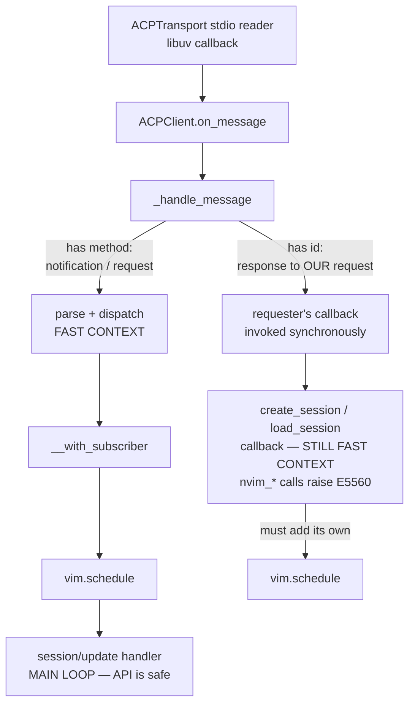

# Provider system

## ACP providers (Agent Client Protocol)

This plugin spawns **external CLI tools** as subprocesses and communicates via
the Agent Client Protocol:

- **Requirements**: External CLI tools must be installed by the user, we don't
  install them for security reasons.
  - `claude-agent-acp` for Claude
  - `gemini` for Gemini
  - `codex-acp` for Codex
  - `opencode` for OpenCode
  - `cursor-agent-acp` for Cursor Agent
  - `auggie` for Augment Code
  - `vibe-acp` for Mistral Vibe

NOTE: Install instructions are in the README.md

## Generic ACPClient (no per-provider adapters)

All providers use a **single generic `ACPClient`** (`acp_client.lua`). There are
no per-provider adapter files. See ADR 0005.

The client parses standard ACP protocol fields and handles provider quirks (e.g.
`rawInput` fallback for OpenCode) inline via protected methods in `ACPClient`
itself.

**Adding a new provider** only requires a config entry in `config_default.lua`
under `acp_providers` — no adapter code needed unless the provider deviates from
ACP in ways not yet handled.

Load the `agentic-acp-protocol-flow` skill before editing `ACPClient`,
`ACPTransport`, `AgentInstance`, ACP provider flow, tool-call parsing,
permission requests, provider switch, reconnect, or ACP subprocess lifecycle.
For schema facts, also load `agentic-acp-docs-and-schema`.

## ACP provider configuration

```lua
acp_providers = {
  ["claude-agent-acp"] = {
    name = "Claude Agent ACP",
    command = "claude-agent-acp",
    env = {
      NODE_NO_WARNINGS = "1",
      IS_AI_TERMINAL = "1",
    },
  },
  ["gemini-acp"] = {
    name = "Gemini ACP",
    command = "gemini",
    args = { "--acp" },
    env = {
      NODE_NO_WARNINGS = "1",
      IS_AI_TERMINAL = "1",
    },
  },
}
```

## Responses and notifications differ in event context

Notification subscriber callbacks are safe to touch the API from; notification
parsing and dispatch are not. Request-response callbacks are also not safe.



- `ACPTransport` invokes `on_message` directly inside its stdio reader, so
  everything below it starts in a **fast event context**.
- **Notifications** route through `ACPClient:__with_subscriber`, which re-resolves
  the subscriber and invokes the handler inside `vim.schedule`. By the time a
  `session/update` handler runs, it is on the main loop.
- **Request responses** have no such hop: `ACPClient:_handle_message` calls the
  requester's callback synchronously, still in the fast context. So a
  `create_session` / `load_session` response callback may not call `nvim_*`
  without its own `vim.schedule`.

The event-context asymmetry can trigger fast-context API failures; see the root
`AGENTS.md` trap and regression test. Response dispatch remains synchronous
because initialization state transitions depend on message ordering. Each
response callback schedules only its API-touching work.

## Protocol flow details

The full event pipeline, ACPClient lifecycle, stdio framing, sync/async
dispatch rules, session-update routing, tool-call lifecycle, permission flow,
provider switch behavior, config option dispatch, subprocess lifecycle, and
reconnect invariants live in the `agentic-acp-protocol-flow` skill.
