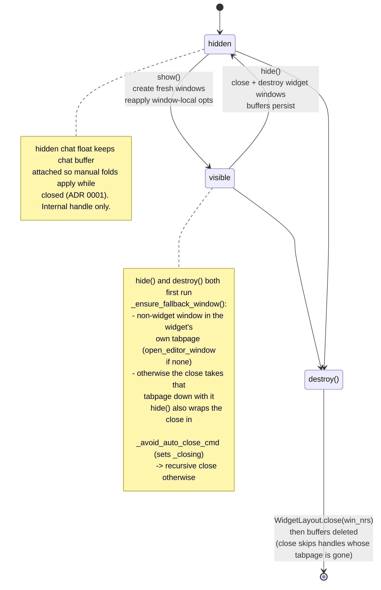

# UI / chat buffer

Hard rules and traps. Read code before changing behavior.

## Anti-staleness rules for this doc

- Cite module + symbol, never line numbers.
- Code blocks describe shape (topology, layouts, decision trees), never
  implementation.
- Every "why" must reference an observable failure (flicker, crash, lost fold).
  If the failure is gone, delete the rule.

## Topology

```text
SessionManager (per session)
└── ChatWidget (per session)  owns buffers + windows + autocmds
    ├── WidgetLayout      open/close/resize panels, applies PANEL_WINDOW_OPTS
    ├── _hidden_chat_winid  float keeping chat buffer attached while widget
    │                       hidden — managed by ChatWidget._hidden_chat_winid
    │                       + WidgetLayout.open_hidden_chat_window — ADR 0001
    ├── BufferGuard       redirects foreign buffers out of widget windows
    ├── WindowDecoration  winbar + buf names; header state read from the
    │                     owning widget via WidgetRegistry.get(bufnr).headers
    ├── DiffPreview       inline/split diff in real file buf (not chat)
    └── MessageWriter (per chat bufnr) ── owns chat-buffer content
        ├── tool_call_blocks    id -> ToolCallBlock (extmark-tracked range)
        ├── ToolCallFold        manual folds, anchor pads — ADR 0001
        ├── ToolCallDiff        diff extraction + minimization
        ├── DiffHighlighter     line/word hl on chat buffer
        │                       (lives in agentic.utils, not ui)
        ├── ToolBlockBorder     ╭ │ ╰ fence glyphs via statuscolumn — ADR 0002
        └── PermissionManager   pending map + focus state; rebinds per-block
                                keymaps on focus transition. Button row +
                                status row rendering owned by MessageWriter
                                (repaint_status_row -> _render_permission_section)
```

## Lifecycle

Widget windows are disposable.



- `hide` closes and destroys every widget window.
- Buffers persist.
- `show` creates fresh windows on every call and reapplies every window-local
  option. There is no "resume" path.
- Before closing widget windows, `hide` ensures a non-widget fallback window
  exists in the same tabpage. If `find_first_non_widget_window` returns nil, it
  calls `open_editor_window` to create one. Skipping this destroys the user's
  tabpage: closing the last window of a non-current tabpage closes that tabpage
  silently, and E444 (cannot close last window) only fires when it is also the
  last tabpage. See `ChatWidget:hide`.
- Programmatic window closes (`hide`, layout rotation) MUST wrap the close call
  in `ChatWidget:_avoid_auto_close_cmd`. The wrapper sets `self._closing = true`
  so the global `WinClosed` autocmd's auto-close-on-user-close branch skips the
  call. Skipping the wrapper triggers recursive close via the autocmd.
- `destroy` never routes through `hide`, but both share
  `ChatWidget:_ensure_fallback_window`. It calls that, then `WidgetLayout.close`
  on its `win_nrs`, then deletes the buffers. Relative to `hide` it skips
  hidden-float recreation, size capture, and `stopinsert` suppression, since a
  destroyed widget will never be shown again. `WidgetLayout.close` skips every
  handle whose tabpage is already gone, which keeps this safe during a tabclose
  teardown on 0.11.x. See `ChatWidget:destroy`.
  - The fallback is mandatory here. `SessionRegistry.show_session` hides
    non-target widgets in the current tabpage and hides the target at its
    previous placement. An outgoing session in another tabpage stays visible.
    Destroying that session reaches `WidgetLayout.close` there, and without the
    fallback that tabpage disappears under the user. Reachable from
    `Agentic.destroy_session` and from session restore. Regression:
    `chat_widget.test.lua::"keeps the tabpage alive when the widget holds its only windows"`.
  - **Ordering: the fallback MUST run before `WidgetRegistry.unregister`.**
    `find_first_non_widget_window` excludes windows showing a registered widget
    buffer, so once the widget is unregistered its own chat window looks like a
    valid fallback and gets handed back.
- A **background session** must never be surfaced by a content callback. The
  `FileList`, `CodeSelection`, `DiagnosticsList` and `TodoList` `on_change`
  handlers call `ChatWidget:rerender`, which no-ops when `get_visible_tab_id()`
  is nil. Calling `show` directly there put a second widget in the current
  tabpage — a `plan` update from a hidden session was enough, with no user
  action at all. The update survives: panel buffers are written before
  `on_change` fires, and `show_layout` decides each panel window from buffer
  emptiness at show time. Regression:
  `tests/integration/test_multi_session.lua::"keeps a hidden session hidden when its file list changes"`.
- `destroy` is the one programmatic close exempt from the
  `_avoid_auto_close_cmd` rule above. It deletes the
  `AgenticWinClosed_<chat bufnr>` augroup before closing, so the only listener
  that ever read `self._closing` is gone by then; setting the flag would guard
  nothing. Any new close path that runs while that augroup still exists MUST
  wrap.
- A hidden chat floating window keeps the chat buffer attached while the widget
  is hidden, so manual folds can be applied while closed. See ADR 0001.
  - Opened with `hide = true` + `focusable = false` + `noautocmd = true`. The
    user cannot reach it: `<C-w>w`/`<C-w>p`, `:wincmd`, and `:buffer` skip it;
    `nvim_list_wins()` returns it but interactive navigation does not visit it.
    Only code holding `widget._hidden_chat_winid` can target it (via
    `nvim_set_current_win`/`nvim_win_set_buf`). Treat it as an internal handle,
    not a window the user might be sitting in. Do NOT add keymaps, buffer-local
    autocmds expecting user focus, or any UX that assumes the user can act
    inside it.

## MessageWriter and tool-call rendering

Load the `agentic-ui-message-writer` skill before editing `MessageWriter`,
`PermissionManager`, tool-call block rendering, sender headers, thinking blocks,
auto-scroll, folds, status rows, permission buttons, or chat-buffer tool-call
tests.

## Window and layout hard rules

- Foreign buffers in widget windows are redirected via `BufferGuard`
  (`lua/agentic/ui/buffer_guard.lua`) to a non-widget window in the same
  tabpage.
- Panel + fold window options (`WidgetLayout.PANEL_WINDOW_OPTS`,
  `Fold.setup_window`) MUST be written via `vim.wo[winid][0]`. See the general
  `:set`-style ban in root `AGENTS.md` "Common traps". Regression:
  `buffer_guard.test.lua::"does not leak widget window options to the editor window after redirect"`.
- Module-level state is forbidden for per-session data. Namespace IDs are exempt
  — IDs are global, isolation comes from per-buffer `nvim_buf_clear_namespace`.
  So is `WidgetRegistry`'s `bufnr -> widget` map: buffer numbers are global too.

## Traps

- `style = "minimal"` on panel windows
  - Stores empty fold map in the buffer's last-window memory; wipes manual folds
    across reopens.
- Setting `foldmethod` / `foldlevel` unconditionally
  - Only `Fold.setup_window` (in `lua/agentic/ui/tool_call_fold.lua`) is allowed
    to write these. The set-handler triggers even on no-op assigns, closing the
    user's `zo`-opened folds. See ADR 0001.
- Calling `nvim_win_close` after tabclose
  - Handle returns valid from `nvim_win_is_valid` but segfaults on 0.11.5. In
    `WidgetLayout.close`, check
    `nvim_tabpage_is_valid(nvim_win_get_tabpage(winid))` per window before
    `nvim_win_close` — not just once at the start of the loop.
- `vim.notify` directly
  - Fast-context errors. Use `Logger.notify`.
- Module-level mutable state for per-session data
  - Leaks one session's state into another. See root `AGENTS.md`.
- Restarting the spinner without bumping `StatusAnimation._epoch`
  - `vim.defer_fn` cannot un-queue a callback that already fired, so a `stop` ->
    `start` cycle straddling a fired-but-unrun timer leaves the old callback to
    schedule a second chain. Two live chains, double frame rate, and the first
    is unreferenced so nothing can cancel it. `start` bumps `_epoch`;
    `_render_frame` returns without rescheduling when the epoch it was scheduled
    with no longer matches. Regression:
    `status_animation.test.lua::"drops a stale frame instead of scheduling a successor"`.
- Two windows holding the chat buffer concurrently
  - Breaks fold-state preservation. ADR 0001.
- Reopening the hidden chat float without closing the previous one
  - Overwrites the stored winid and leaks the prior window.
- `:edit` on a widget buffer
  - Buffer keeps its ID but gains a name and `buftype != "nofile"`.
    `BufferGuard` detects this on `BufEnter` and swaps a fresh scratch buffer
    into the widget window, redirecting the named buffer out. The replacement
    buffer takes over the panel's `buf_nrs` entry and is re-registered, so the
    single shared augroup can still resolve the window's owner on the next
    event. Re-grep `BufferGuard` for the exact entry point before refactoring.
- Writing header state back after reading it
  - `WindowDecoration`'s header-state getter hands back the owning widget's own
    `ChatWidget.headers` table, so an in-place mutation is already visible to
    the next reader. Mutate it in place; there is no setter and none is needed.
    Tab-scoped storage returned copies and needed a write-back; a real table
    does not, and a copying setter would drop concurrent edits. When no widget
    owns the bufnr the getter deep-copies the module defaults instead, so a
    mutation on that path is discarded — do not treat the fallback as shared
    state. Regressions:
    `chat_widget.test.lua::"keeps each widget's header context independent"` and
    `::"hands out a fresh default table per call when no widget owns the bufnr"`.
- Direct `nvim_buf_set_name` for widget buffers
  - Session restore (e.g. `mksession` with `blank` in `sessionoptions`) persists
    agentic buffer names; direct calls raise E95 on reopen. Use
    `WindowDecoration._set_buffer_name`, which renames any pre-existing holder
    to `<name>-old-N`. Regression: `lua/agentic/ui/window_decoration.test.lua`.

## Test invariants

Each invariant has an existing regression test. Deleting one is a behavior
change. MessageWriter-specific invariants live in `agentic-ui-message-writer`.

- Fold survives window close + reopen —
  `tool_call_fold.test.lua::setup_window::"preserves fold ranges across window close + reopen"`.
- Fold creation gated by screen-row count > threshold —
  `tool_call_fold.test.lua::should_fold::"folds when screen-row count exceeds threshold"`.
- Fold counts wrapped rows, not buffer lines (one mega-line still folds) —
  `tool_call_fold.test.lua::should_fold::"folds a single buffer line that wraps past the threshold"`.
- Widget window options do not leak to redirected buffers —
  `buffer_guard.test.lua::"does not leak widget window options to the editor window after redirect"`.
